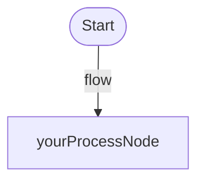

# Debugging Your Graph

Learn how to debug, visualize, and monitor your LiteSwiftGraph workflows.

## Overview

LiteSwiftGraph provides comprehensive debugging tools to help you understand exactly what's happening during graph execution. This tutorial covers all debugging approaches from basic logging to advanced SwiftUI visualizations.

## Step 1: Enable Basic Debug Logging

The simplest way to debug your graph is to enable built-in debug mode.

```swift
let yourGraph = AgentGraph(
    startNode: "yourStartNode", 
    outputKey: "yourOutput", 
    debug: true  // 🔍 Enable debug logging
) {
    Node.context("yourStartNode") { context in
        // Your actual logic here
        print("Processing: \(context["input"]!)")
        return ["data": "processed"]
    }
    
    Node.context("yourProcessNode") { context in
        // Your actual processing logic
        return ["yourOutput": "final result"]
    }
    
    Edge(from: "yourStartNode", to: "yourProcessNode")
}

// Execute and see debug output
let result = try await yourGraph.run("test input")
```

### Debug Output Example

```
🔍 DEBUG: Starting graph execution at node: yourStartNode
🔍 DEBUG: Executing node: yourStartNode
Processing: test input
🔍 DEBUG: Node yourStartNode result keys: data
🔍 DEBUG: Found 1 possible edges from node yourStartNode
🔍 DEBUG: Taking unconditional edge: yourStartNode -> yourProcessNode
🔍 DEBUG: Executing node: yourProcessNode
🔍 DEBUG: Node yourProcessNode result keys: yourOutput
🔍 DEBUG: End of workflow reached
```

## Step 2: Generate Visual Diagrams

Create diagrams to understand your graph structure.

### Mermaid Diagrams (Always Available)

```swift
// Generate diagram of your actual graph
yourGraph.printMermaidDiagram()

// Or get the diagram code for documentation
let diagramCode = yourGraph.generateMermaidDiagram()
```

**Output:**


> Tip: Copy the Mermaid code to [Mermaid Live Editor](https://mermaid.live) for interactive visualization.

### ASCII Diagrams (With Debug Library)

```swift
import LiteSwiftGraphDebug

let renderer = GraphRenderer(graph: yourGraph)
print(renderer.renderASCII())
```

**Output:**
```
Graph Structure:
===============

[START] yourStartNode
  ---> yourProcessNode
[NODE] yourProcessNode
```

## Step 3: Real-Time Execution Monitoring

Monitor your graph execution in real-time using the debug console.

```swift
import LiteSwiftGraphDebug

// Create a debug console for real-time monitoring
let console = GraphDebugConsole(graph: yourGraph)

// Execute your graph - console automatically shows updates
let result = try await yourGraph.run("monitor this")
```

### Interactive Step-by-Step Debugging

```swift
import LiteSwiftGraphDebug

// Enable step-by-step debugging
let interactiveConsole = InteractiveDebugConsole(graph: yourGraph)
interactiveConsole.enableStepMode()

// Execute - will pause at each node
let result = try await yourGraph.run("step through this")
```

## Step 4: Instant SwiftUI Debug Views

Get instant SwiftUI views for visual debugging - just like `generateMermaidDiagram()`!

```swift
import SwiftUI
import LiteSwiftGraph
import LiteSwiftGraphDebug

// Your actual graph
let yourGraph = AgentGraph(startNode: "start", outputKey: "result", debug: false) {
    // Your nodes and edges...
}

// Instant debug views - zero setup required!
struct DebugApp: App {
    var body: some Scene {
        WindowGroup("Debug View") {
            yourGraph.graphView()      // 🎯 Instant debug visualization
        }
        
        WindowGroup("Live Execution") {  
            yourGraph.liveView()       // 🚀 Live execution with controls
        }
        
        WindowGroup("Structure") {
            yourGraph.structureView()  // 📊 Compact structure view
        }
    }
}
```

### Embedding Debug Views

```swift
struct YourContentView: View {
    let yourGraph = createYourGraph()
    
    var body: some View {
        VStack {
            Text("Your Application")
                .font(.title)
            
            // Embed debug view anywhere
            yourGraph.graphView()
                .frame(height: 300)
                .border(Color.gray)
            
            // Or show structure inline
            yourGraph.structureView()
                .frame(height: 200)
        }
    }
}
```

## Step 5: Debug Complex Execution Paths

Debug graphs with conditional branching and error handling.

```swift
let complexGraph = AgentGraph(
    startNode: "validate", 
    outputKey: "result", 
    debug: true
) {
    Node.context("validate") { context in
        let input = context["input"] as! String
        let isValid = input.count > 3
        
        print("🔍 Validating: \(input) -> \(isValid ? "valid" : "invalid")")
        
        return [
            "input": input,
            "isValid": isValid,
            "attempts": 1
        ]
    }
    
    Node.context("process") { context in
        print("✅ Processing valid input")
        return ["result": "Successfully processed"]
    }
    
    Node.context("retry") { context in
        let attempts = context["attempts"] as! Int
        print("🔄 Retry attempt \(attempts)")
        
        if attempts >= 3 {
            return ["result": "Failed after 3 attempts"]
        }
        
        return [
            "input": "retried_\(context["input"]!)",
            "isValid": true,  // Simulate success after retry
            "attempts": attempts + 1
        ]
    }
    
    // Conditional edges
    Edge(from: "validate", to: "process", description: "valid input", condition: { context in
        context["isValid"] as? Bool == true
    })
    
    Edge(from: "validate", to: "retry", description: "invalid input", condition: { context in
        context["isValid"] as? Bool == false
    })
    
    Edge(from: "retry", to: "validate", description: "retry validation", condition: { context in
        let attempts = context["attempts"] as? Int ?? 0
        return attempts < 3
    })
    
    Edge(from: "retry", to: "process", description: "max retries", condition: { context in
        let attempts = context["attempts"] as? Int ?? 0
        return attempts >= 3
    })
}

// Test with invalid input to see retry logic
let result = try await complexGraph.run("hi")
```

## Step 6: Debug Execution Paths with Mermaid

Visualize actual execution paths through your graph.

```swift
// Create a graph with execution tracking
let trackingGraph = AgentGraph(startNode: "start", outputKey: "result", debug: false) {
    // Your graph definition...
}

// Track execution path
var executionPath: [String] = []
let observer = PathTrackingObserver { nodeName in
    executionPath.append(nodeName)
}
trackingGraph.addObserver(observer)

// Execute
let result = try await trackingGraph.run("input")

// Generate diagram with execution path highlighted
let executionDiagram = trackingGraph.generateMermaidDiagramWithPath(executionPath)
print(executionDiagram)
```

## CLI and UI Applications for Debugging

### Using the CLI Application

```bash
# Interactive command-line debugging
swift run LiteSwiftGraphCLI

# Choose workflows and see live execution
# Perfect for testing graph logic
```

### Using the SwiftUI Application

```bash
# Full visual debugging environment
swift run LiteSwiftGraphUI

# Features:
# - Live graph visualization
# - Interactive execution
# - Real-time node highlighting
# - Execution logs
# - Multiple example workflows
```

## Debugging Best Practices

### 1. Start with Debug Mode

Always start development with `debug: true`:

```swift
let graph = AgentGraph(startNode: "start", outputKey: "result", debug: true) {
    // Development with full logging
}
```

### 2. Use Descriptive Node Names

```swift
// ✅ Good - clear what this node does
Node.context("validateUserInput") { context in ... }

// ❌ Bad - unclear purpose  
Node.context("node1") { context in ... }
```

### 3. Add Debug Prints in Complex Logic

```swift
Node.context("complexAnalysis") { context in
    let data = context["data"] as! [String]
    print("🔍 Analyzing \(data.count) items")
    
    let result = performComplexAnalysis(data)
    print("🔍 Analysis result: \(result)")
    
    return ["analysis": result]
}
```

### 4. Use Edge Descriptions for Clarity

```swift
Edge(from: "validate", to: "process", description: "valid input", condition: { context in
    context["isValid"] as? Bool == true
})

Edge(from: "validate", to: "retry", description: "needs retry", condition: { context in
    context["isValid"] as? Bool == false
})
```

## Troubleshooting Common Issues

### Graph Doesn't Execute

**Problem:** Graph execution stops unexpectedly.

**Solution:** Check that:
1. All nodes referenced in edges exist
2. At least one edge condition evaluates to `true`
3. The `outputKey` exists in the final context

```swift
// Add debug logging to edge conditions
Edge(from: "start", to: "next", condition: { context in
    let shouldContinue = context["valid"] as? Bool == true
    print("🔍 Edge condition: \(shouldContinue)")
    return shouldContinue
})
```

### Missing Output Key

**Problem:** `outputKeyMissing` error.

**Solution:** Ensure your final node returns the expected key:

```swift
Node.context("finalNode") { context in
    // Make sure this matches your outputKey
    return ["result": "final value"]  // if outputKey is "result"
}
```

### Infinite Loops

**Problem:** Graph execution never completes.

**Solution:** LiteSwiftGraph has built-in cycle detection, but you can add explicit checks:

```swift
Node.context("loopingNode") { context in
    let iterations = (context["iterations"] as? Int) ?? 0
    
    if iterations > 10 {
        print("🚨 Breaking potential infinite loop")
        return ["result": "loop_detected"]
    }
    
    return ["iterations": iterations + 1]
}
```

## What You've Learned

✅ How to enable and interpret debug logging  
✅ How to generate visual diagrams (Mermaid & ASCII)  
✅ How to monitor execution in real-time  
✅ How to use instant SwiftUI debug views  
✅ How to debug complex conditional flows  
✅ How to troubleshoot common issues  
✅ How to use CLI and UI debugging applications  

## Next Steps

- Learn <doc:ErrorHandlingAndRetries> for robust error handling
- Explore <doc:BuildingComplexWorkflows> for advanced patterns
- Try <doc:SwiftUIIntegration> for building visual applications